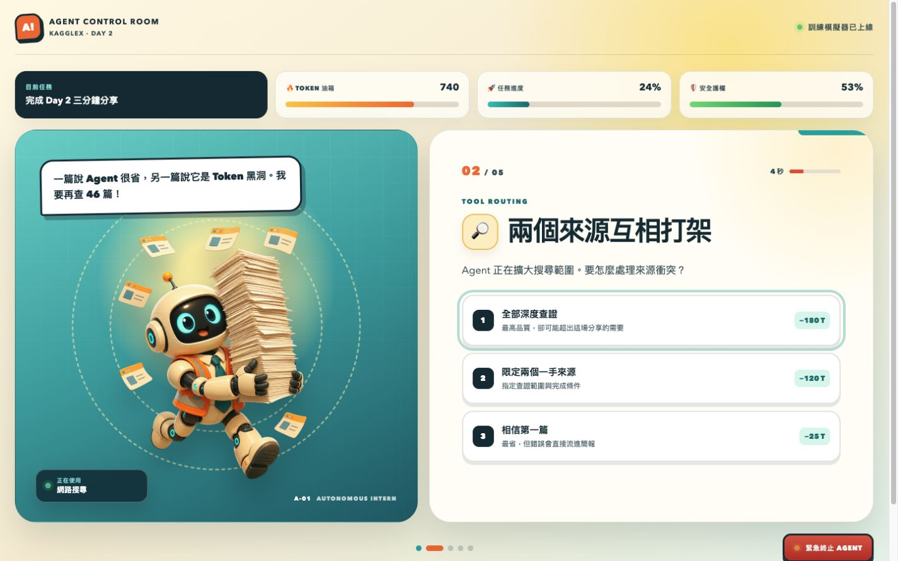

# AI 實習生失控記

一個為 KaggleX Google Vibe Coding Day 2 讀書會設計的兩分鐘網頁遊戲。玩家要在 1,000 Token 預算內監督一位熱情過頭的 AI Agent，並依本局任務平衡進度、成果品質與工具安全。



## 遊戲重點

- 五個 Agent 監督事件：Context、來源查證、重試迴圈、目標漂移與發布權限
- 開局隨機抽取「緊急 Demo」、「研究稿」或「法遵報告」，三種任務有不同門檻與多條可行策略
- 全局只有兩次護欄介入；用完後，其他需要人工控制的選項會鎖定
- 前面的決策會改變後續成本與風險，例如全文索引能降低查證成本，資訊缺口則會放大誤發傷害
- 每局重新排列選項位置，避免靠固定按鍵背答案
- 12 秒決策倒數；逾時後 Agent 會自行選擇
- 可隨時按下全域 Kill Switch，但任務也會立刻停止
- Token、進度、品質與安全四軸計分
- 六種結局與逐項 PASS／MISS 任務報告
- 支援桌面、手機與鍵盤 `1`／`2`／`3` 快捷鍵
- 完全在瀏覽器中模擬，不會真的呼叫模型 API 或消耗 Token

## 本機執行

不需要安裝任何相依套件。

```bash
npm run dev
```

開啟 [http://localhost:4173](http://localhost:4173)。

## 測試

```bash
npm test
npm run check
```

測試會窮舉三種任務的所有合法路徑，確認每種任務都有多條過關方式，也驗證護欄上限、連鎖後果、選項洗牌與全域終止開關。

## 專案結構

```text
├── index.html              # 遊戲畫面與語意結構
├── styles.css              # 原創 3D 動畫風 UI、動效與響應式版面
├── app.js                  # 瀏覽器互動、倒數與畫面切換
├── game-engine.js          # 純函式遊戲規則與結局判定
├── assets/ai-intern.png    # AI 生成並去背的原創角色
├── docs/gameplay.png       # 實際瀏覽器驗證截圖
└── tests/                  # Node 內建測試
```

## 視覺素材

AI 實習生為本專案新生成的原創角色，使用 Codex 內建 OpenAI 圖像生成工具製作，再以 chroma key 流程去背。完整生成規格請見 [`docs/image-prompt.md`](docs/image-prompt.md)。角色沒有使用或重製既有動畫人物。

## 教學訊息

> Agent 沒有萬用的「最佳答案」；控制策略必須對齊任務門檻。

遊戲把四個抽象設計原則轉成可以親手操作的機制：任務條件、狀態與記憶、有限的護欄介入，以及對高風險工具保留 Human-in-the-loop。
